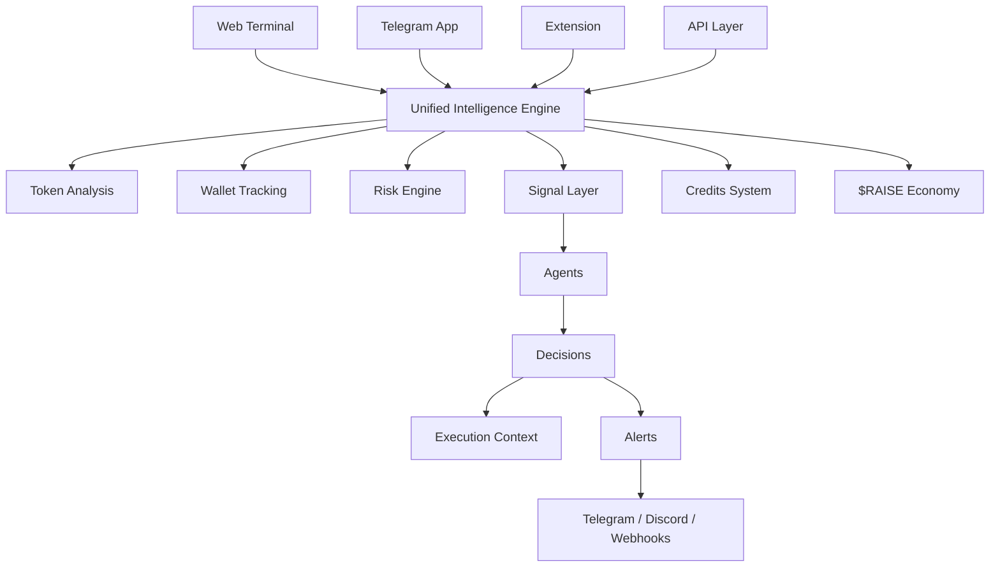

<p align="center">

</p>

<h1 align="center">Voltraise</h1>

<div align="center">
  <p><strong>AI-native on-chain intelligence terminal for Solana</strong></p>
  <p>
    Token quality • Wallet behavior • Risk overlays • Real-time signals • Execution context
  </p>
</div>

---

### 🚀 Quick Links

[](#)

[](#)

[](#)

[](#)

---

> [!IMPORTANT]
> Voltraise is a non-custodial analytics and trading intelligence platform. You always control your assets

> [!WARNING]
> On-chain markets are volatile. Signals and analytics do not eliminate risk

> [!TIP]
> Use agents and risk overlays as a second layer of decision support, not as blind execution

> [!NOTE]
> The platform is evolving. New analytics layers, agents, and integrations are continuously added

---

## What’s Actually Broken

Most tools show movement, not structure

They show candles, volume spikes, and trending tokens  
but fail to answer:

- is liquidity real or fragile  
- who is actually holding and moving the token  
- whether this is sustainable flow or short-term noise  
- how this position fits into total exposure  

> [!CAUTION]
> Entering positions without structure often leads to hidden concentration and uncontrolled risk

---

## The Shift (New Mental Model)

Voltraise treats the market as a **system of signals, flows, and risk states**, not isolated charts

Instead of:

| Old Approach | Voltraise Approach |
|-------------|------------------|
| Price-first | Structure-first |
| Reactive trading | Context-driven decisions |
| Fragmented tools | One unified system |
| Indicators | Explainable signals |

You don’t just see movement  
you understand **why it exists and what it implies**

---

## Product View



---

## Proof (Hard Signal)

**Before**

- switching between 5–7 tools  
- no unified risk view  
- reactive entries  

**After**

- single terminal for analysis + execution  
- structured signals instead of noise  
- clear exposure and liquidity awareness  

> Real outcome: fewer impulsive trades, more filtered entries, better session consistency

---

## Try the Core Loop (Fast Win)

1. Pick a token  
2. Open intelligence view  
3. Check liquidity + holders + wallet flow  
4. Review signals + agent summary  
5. Decide or ignore  

That’s the loop  
Everything else builds on top of it  

---

## Real Scenarios (Not Toy)

### 1. Early Token Validation  
You see a new token moving  
→ check liquidity depth, holder distribution, wallet clusters  
→ avoid entering into unstable structure  

### 2. Momentum With Context  
Token is trending  
→ verify if flow is sustained or shallow  
→ align entry with real demand  

### 3. Portfolio Risk Control  
Multiple positions open  
→ detect hidden concentration across similar tokens  
→ reduce exposure before drawdown  

---

## Mechanics (Under the Hood Lite)

Voltraise processes:

- market data streams  
- wallet activity  
- liquidity state  
- holder distribution  

Then builds:

- signals  
- risk overlays  
- agent summaries  

```text
raw data → normalization → enrichment → signals → agents → decision context
```

---

## Why Not X

| Approach | Limitation |
|---------|-----------|
| Manual analysis | too slow, fragmented |
| GPT wrappers | no real data grounding |
| Basic scanners | surface-level metrics |
| Voltraise | structured, explainable, real-time system |

---

## Failure Cases (Respect Time)

Voltraise is not for:

- fully passive trading  
- blind automation  
- guaranteed outcomes  

It may be overkill if:

- you only track price  
- you don’t use structured decision-making  
- you trade purely on instinct  

---

## Final Position

Voltraise is not a charting tool  
It is a **decision system for on-chain trading**

Where:

- signals explain  
- agents interpret  
- you decide  

---

